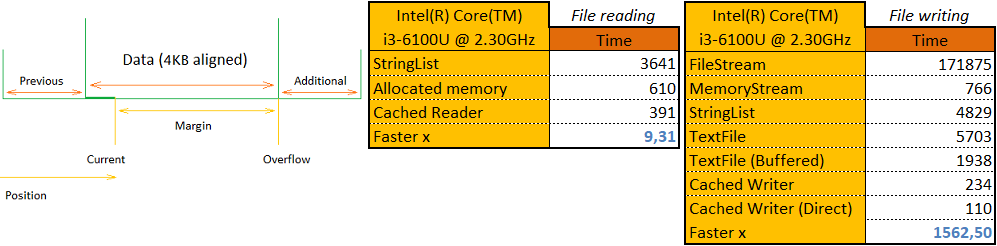

### Concept

The library is developed by [Zephyr Software](https://www.zephyr-soft.net) company. We specialize in the most complex, ambitious and high-performance projects written in Delphi 7-XE10, FreePascal and C++Builder. [Fill out an application](https://www.zephyr-soft.net/eng) for a **free** 30-minute consultation if you need to support a project or develop a new one!

The need for a library appeared because we are increasingly working with low-level code, and we need to support different versions of the compiler. We transfer some units from other open repositories, we take some code in closed repositories, we adapt and develop some units. Part of the code is written in C and assembler. Firstly, we want to maintain compatibility with C/C ++ projects. Secondly, these languages allow us to write low-level fast code. The name of the library contains _"Tiny"_ because the principle of low-level programming minimizes the dependencies of standard units, which in turn leads to a small size of the output binary files.

You may read a more detailed description of the functionality in the sections below:
* [General](#general)
* [Text](#text)
* [Generics](#generics)
* [Rtti](#rtti)
* [Tests](#tests)
* [Services](#services)
* [Delphi](#delphi)

### General

The library has a lot of general purpose code. One of the main units is _Tiny.Types.pas_ - it stores the basic types, synchronization primitives and constants. One of the key features of the unit is to ensure code compatibility for different versions of Delphi and FreePascal. For example, on older versions of Delphi there are no `NativeInt` or `UnicodeString` types, and on NEXTGEN compilers there are no `WideString` or `ShortString` types - in this case they are emulated. On older versions of Delphi and FreePascal, there are no familiar `Atomic-`functions or TypeInfo initialization/copy/finalization functions (`InitializeArray`, `CopyRecord`, etc.) - all of them are also emulated. The `TinyMove` function deserves special attention - its purpose is the same as `System.Move`, but it works faster.

The _Tiny.Cache.Buffers.pas_ unit contains several classes that allow you to process data streams at a high speed due to preliminary buffering of data, read more in the section [CachedBuffers.md](doc/CachedBuffers.md).

### Text

Text processing usually is a resource-intensive task. In addition, a text is a simple, flexible and readable data exchange format, therefore it is often used, for example, in network data exchange protocols. The `Tiny.Library` library contains a lot of code that allows you to quickly convert, compare, cache, read or write text data. The main units are _Tiny.Text.pas_ and _Tiny.Cache.Text.pas_. For a more detailed description, see the section [Text.md](doc/Text.md).

### Generics

The _Tiny.Generics.pas_ unit was created in almost full compliance with the standard Delphi generics. The advantageous differences of the unit are performance, compactness and additional features. Read more in the section [Generics.md](doc/Generics.md).

### Rtti

One of the most difficult low-level programming tasks that we have encountered is the task of marshalling and executing functions based on _Run Time Type Information_ (RTTI). First, RTTI is very different between the Delphi and FreePascal versions. Secondly, RTTI is not generated in all cases, for example, `Pointer` will not be generated in `{$M+}` interfaces or older versions of Delphi. Thirdly, in FreePascal or older versions of Delphi there is no invocation routine, which is sometimes very necessary. Therefore, the concept of a universal data representation was developed and implemented in units _Tiny.Rtti.pas_, _Tiny.Invoke.pas_, _Tiny.Namespace.pas_, _Tiny.Marshalling.pas_, etc. Read a more detailed description in the section [Rtti.md](doc/Rtti.md).

### Tests

_ToDo_

### Services

_ToDo_

### Delphi

We choose Delphi because in our opinion it is a simple, powerful and high-performance programming language. It allows you to cover almost all programming needs: PC, server, web, mobile, 3D, IoT. We are proud to have known Delphi for over 20 years. Few people know that the language was named after the ancient Greek town. Below are our personal photos from it :blush:

