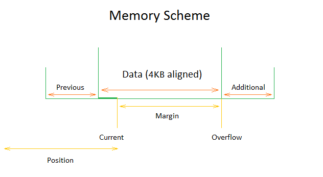
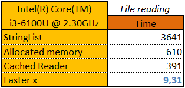
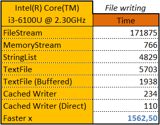

### Concept

The _Tiny.Cache.Buffers.pas_ unit is indispensable for tasks of sequential reading or writing data, especially if performance requirements are increased and there is a lot of data. The library is based on two main classes: `TCachedReader` and` TCachedWriter`. The functionality of these two classes largely repeats the standard `TStream` class, but the difference is that you use a convenient temporary memory buffer. This architecture allows direct access to memory and improves performance by avoiding calling virtual functions, universal implementations, and API functions of operating systems. An example of using the library and an illustration of high performance can be seen in the demo projects.

The `TCachedReader` and `TCachedWriter` classes are supposed to indicate a callback in order to fulfill or commit a buffer.  However, the library already contains a several standard classes which help to perform distributed tasks: `TCachedFileReader`, `TCachedFileWriter`, `TCachedMemoryReader`, `TCachedMemoryWriter` and `TCachedResourceReader`. In the future there also may be standard classes for the network interaction.

The library also contains `TCachedReReader` and `TCachedReWriter` classes which serve to be intermediate members. Those classes are necessary when the data is sequentially converted from one format to another. For example, if your parser receives data  (`TCachedReader`) in the UTF-16LE encoding and an open file (`TCachedFileReader`) is written in another encoding, then you will need an intermediate member (`TCachedReReader`) processing the conversion into UTF-16LE. Another striking example of an intermediate member is the ZLib library data compression and decompression.

### TCachedBuffer

The `TCachedBuffer` is a mutual ancestor for the `TCachedReader` and the `TCachedWriter`. The main class property is the `Memory`. It is a allocated memory buffer aligned to 4KB which also has `Previous` и `Additional` areas (the description will be given below). The size of the buffer is set in a constructor where the default value is 64KB. If the size is not multiple of 4KB then the size automatically align (e.g. 5000 aligns to 8192). Please note that in some cases (for example, fixed or preallocated), the size of the memory buffer, as well as the previous/additional areas, may be aligned to 1KB or be completely absent.



To fill or read the buffer is used `Current`/`Overflow` pair. `Current` indicates the position in a buffer and allows the direct access to the memory. `Overflow` is an upper limit of the buffer. `Margin` defines the number of bytes accessible in a buffer (`Overflow - Current`). The `Flush` function updates the buffer and returns the number of bytes accessible in a buffer (`Margin`). The function may return 0 if the reading or writing is over. 

The `EOF` is an indication of the end of the reading or writing, which also may be set to `True`. If needed it is possible to limit the reading or writing size by setting the `Limit` value.

```pascal
TCachedBufferKind = (cbReader, cbWriter);
TCachedBufferCallback = function(const ASender: TCachedBuffer; AData: PByte; ASize: NativeUInt): NativeUInt of object;
TCachedBufferProgress = procedure(const ASender: TCachedBuffer; var ACancel: Boolean) of object;

TCachedBuffer = class(TTinyObject)
public
  Current: PByte;
  function Flush: NativeUInt;    
  property Kind: TCachedBufferKind read
  property Overflow: PByte read
  property Margin: NativeInt read
  property EOF: Boolean read/write
  property Limited: Boolean read
  property Limit: Int64 read/write
  property Memory: TCachedBufferMemory read
  property Position: Int64 read 
  property OnProgress: TCachedBufferProgress read/write
end;
```

### TCachedReader

The `TCachedReader` is used for the sequential data reading. The direct use of a buffer is allowed with the `Current`, `Overflow` properties and `Flush` function but for convenience sake you may use high-level `TStream`-like methods `Read` and `ReadData`. The `Skip` method allows to pass through a certain number of useless bytes. The `Export` method allows to write whole or a certain number of data bytes in the `TCachedWriter`.

The main constructor’s parameter is a `Callback`. It is a function which fills the buffer. During reading much data the `Callback` may be called passing the buffer. If the `Callback` returns less than `Size` parameter then the `Finishing` flag is set to `True` and at the next `Flush` the reading will be over (`EOF = True`).

The `Memory.Additional` (`Overflow`) area is always bigger than 4KB and may also serve for any reading needs the main of which is an AccessViolation avoidance with specific algorithms of data parsing. At the `Flush` moment the `Current` pointer may be less than `Overflow`. In this case the margin data is transferred to the `Memory.Previous` area. For example it is useful when the algorithm offers the struct processing and it is not fully stored in the buffer. The same is with lexeme parsing. The size of `Memory.Previous` area is minimum 4KB and when necessary it automatically grows during the `Flush` moment. But if the `Current` pointer is bigger than `Overflow` an exception will be thrown.

The `DirectRead` procedure allows data reading from a random place even without the buffer memory.  Some instances of the `TCachedReader` allow addressing to random places (e.g. files or memory). If the addressing to random places is not supported, better be careful. While reading "before" the buffer an exception will throw. While reading "after" the buffer, it will be enlarged to the necessary size what can lead to memory shortage.

```pascal
TCachedReader = class(TCachedBuffer)
public
  constructor Create(const ACallback: TCachedBufferCallback; const ABufferSize: NativeUInt = 0);
  procedure DirectRead(const APosition: Int64; var ABuffer; const ACount: NativeUInt);
  property Finishing: Boolean read
  procedure Skip(const ACount: NativeUInt);
  procedure Export(const AWriter: TCachedWriter; const ACount: NativeUInt = 0);

  procedure Read(var ABuffer; const ACount: NativeUInt);
  procedure ReadData(var AValue: Boolean);
  procedure ReadData(var AValue: AnsiChar);
  procedure ReadData(var AValue: WideChar);
  procedure ReadData(var AValue: ShortInt);
  procedure ReadData(var AValue: Byte);
  procedure ReadData(var AValue: SmallInt);
  procedure ReadData(var AValue: Word);
  procedure ReadData(var AValue: Integer); 
  procedure ReadData(var AValue: Cardinal);
  procedure ReadData(var AValue: Int64); 
  procedure ReadData(var AValue: UInt64);
  procedure ReadData(var AValue: Single);
  procedure ReadData(var AValue: Double);
  procedure ReadData(var AValue: TExtended80Rec);
  procedure ReadData(var AValue: Currency);
  procedure ReadData(var AValue: TPoint);
  procedure ReadData(var AValue: TRect); 
  procedure ReadData(var AValue: ShortString); 
  procedure ReadData(var AValue: AnsiString; ACodePage: Word = 0);
  procedure ReadData(var AValue: WideString);
  procedure ReadData(var AValue: UnicodeString);
  procedure ReadData(var AValue: TBytes); 
  procedure ReadData(var AValue: Variant);
end;
```



### TCachedWriter

The `TCachedWriter` is used for the sequential data writing. The class has only several differences from the `TCachedReader`.

The size of the `Memory.Previous` area may be equal 0 that is why do not write anything “before” the buffer. The size of the `Memory.Additional` (`Overflow`) is minimum 4KB. A writing in this area is permitted (`Current` is bigger than `Overflow`) and then at the next `Flush` an overflowed data will be transferred to the beginning of the buffer. If while `Flush` the `Current` pointer is less than `Overflow` then the writing is considered to be over and the `EOF` is set to `True`.

```pascal
TCachedWriter = class(TCachedBuffer)
public
  constructor Create(const ACallback: TCachedBufferCallback; const ABufferSize: NativeUInt = 0);
  procedure DirectWrite(const APosition: Int64; const ABuffer; const ACount: NativeUInt);
  procedure Import(const AReader: TCachedReader; const ACount: NativeUInt = 0);

  procedure Write(const ABuffer; const ACount: NativeUInt);
  procedure WriteData(const AValue: Boolean);    
  procedure WriteData(const AValue: AnsiChar);    
  procedure WriteData(const AValue: WideChar);
  procedure WriteData(const AValue: ShortInt);
  procedure WriteData(const AValue: Byte); 
  procedure WriteData(const AValue: SmallInt);
  procedure WriteData(const AValue: Word);
  procedure WriteData(const AValue: Integer); 
  procedure WriteData(const AValue: Cardinal);
  procedure WriteData(const AValue: Int64);    
  procedure WriteData(const AValue: UInt64);    
  procedure WriteData(const AValue: Single);
  procedure WriteData(const AValue: Double);
  procedure WriteData(const AValue: TExtended80Rec);
  procedure WriteData(const AValue: Currency);
  procedure WriteData(const AValue: TPoint);
  procedure WriteData(const AValue: TRect); 
  procedure WriteData(const AValue: ShortString);
  procedure WriteData(const AValue: AnsiString); 
  procedure WriteData(const AValue: WideString); 
  procedure WriteData(const AValue: UnicodeString);
  procedure WriteData(const AValue: TBytes); 
  procedure WriteData(const AValue: Variant);
end;
```



### TCachedReReader

The `TCachedReReader` is an intermediate member in reading tasks where a sequential data converting from one format to another is required. If during "destructor" the `Owner` is `True` then the `Source` is destroyed too. **Pay attention** to the fact that while calling the `Callback` the `TCachedReReader` itself is a `Sender` parameter but not the `Source`.

```pascal
TCachedReReader = class(TCachedReader)  
public
  constructor Create(const ACallback: TCachedBufferCallback; const ASource: TCachedReader; const AOwner: Boolean = False; const ABufferSize: NativeUInt = 0);
  property Source: TCachedReader read
  property Owner: Boolean read/write
end;
```

### TCachedReWriter

The `TCachedReWriter` is an intermediate member in writing tasks where a sequential data converting from one format to another is required. If during "destructor" the `Owner` is `True` then the `Target` is destroyed too. **Pay attention** to the fact that while calling the `Callback` the `TCachedReWriter` itself is a `Sender` parameter but not the `Target`.

```pascal
TCachedReWriter = class(TCachedWriter)
public
  constructor Create(const ACallback: TCachedBufferCallback; const ATarget: TCachedWriter; const AOwner: Boolean = False; const ABufferSize: NativeUInt = 0);
  property Target: TCachedWriter read
  property Owner: Boolean read/write  
end;
```

### TCachedFileReader

The `TCachedFileReader` is a standard class designed for files reading of their parts. The `Limit` property is automatically set and equals the size of the file or the `Size` parameter.

```pascal
TCachedFileReader = class(TCachedReader)
public
  constructor Create(const AFileName: string; const AOffset: Int64 = 0; const ASize: Int64 = 0);
  constructor CreateHandled(const AHandle: THandle; const ASize: Int64 = 0; const AHandleOwner: Boolean = False);
  property FileName: string read
  property Handle: THandle read
  property HandleOwner: Boolean read/write
  property Offset: Int64 read
end;
```

### TCachedFileWriter

The `TCachedFileWriter` is a standard class designed for files writing or their parts. The `Limit` parameter is set if the `Size` parameter is defined.

```pascal
TCachedFileWriter = class(TCachedWriter)
public
  constructor Create(const AFileName: string; const ASize: Int64 = 0); 
  constructor CreateHandled(const AHandle: THandle; const ASize: Int64 = 0; const AHandleOwner: Boolean = False);
  property FileName: string read
  property Handle: THandle read
  property HandleOwner: Boolean read/write
  property Offset: Int64 read
end;
```

### TCachedMemoryReader

`TCachedMemoryReader` is a standard class designed for compatibility of the `TCachedReader` with the reading from a specified memory area. The `Limit` property is automatically set and it equals `Size`. The `Fixed` parameter allows you to read data from memory directly, but this can lead to errors, because the standard logic of memory alignment and vailability of previous/additional areas is broken.

```pascal
TCachedMemoryReader = class(TCachedReader)
public
  constructor Create(const APtr: Pointer; const ASize: NativeUInt; const AFixed: Boolean = False);
  property Ptr: Pointer read
  property Size: NativeUInt read
end;
```

### TCachedMemoryWriter

`TCachedMemoryWriter` is a standard class designed for compatibility of the `TCachedWriter` with the writing to the temporary or specified memory area. If it is a `CreateTemporary` then the `Ptr` memory resizes with every `Flush` calling. The `Fixed` parameter allows you to write data into memory directly, but this can lead to errors, because the standard logic of memory alignment and vailability of previous/additional areas is broken.

```pascal
TCachedMemoryWriter = class(TCachedWriter)
public
  constructor Create(const APtr: Pointer; const ASize: NativeUInt; const AFixed: Boolean = False);
  constructor CreateTemporary;
  property Temporary: Boolean read
  property Ptr: Pointer read
  property Size: NativeUInt read
end;
```

### TCachedResourceReader

`TCachedResourceReader` is a standard class designed for compatibility of the `TCachedReader` with the reading of the resources. It repeats interface of the `Classes.TResourceStream`.

```pascal
TCachedResourceReader = class(TCachedMemoryReader)
public
  constructor Create(const AInstance: THandle; const AResName: string; const AResType: PChar; const AFixed: Boolean = False);
  constructor CreateFromID(const AInstance: THandle; const AResID: Word; const AResType: PChar; const AFixed: Boolean = False);
end;
```